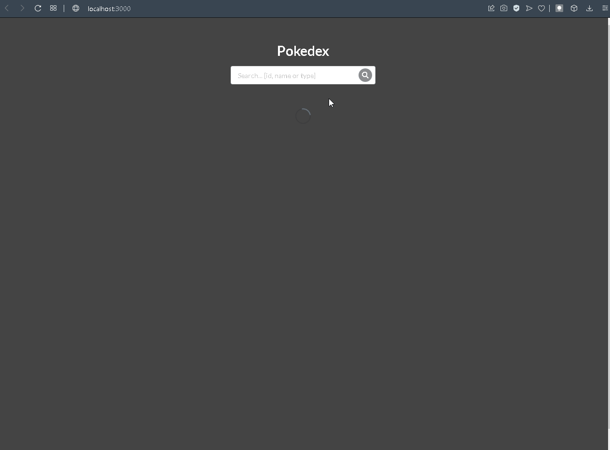
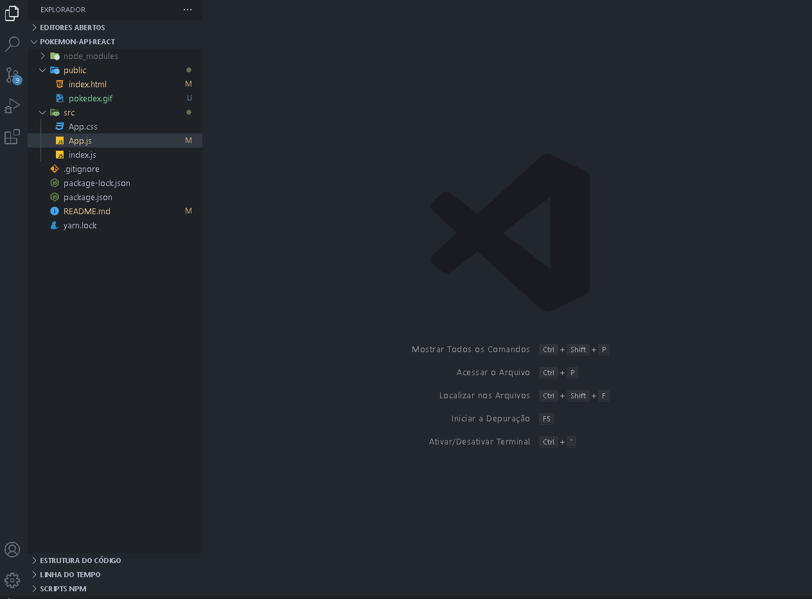

# Sobre
<p>Um pokedex simples que utiliza a PokeApi, uma api com dados de pokemons.</p>
 

# Dependência
```bash
npm install
```

# Rodar aplicação
<p>Após instalar a dependência</p>

```bash
npm start
```

# Carregar mais pokemons
<p>É possivel carregar até 898 pokemons até o momentos do upload. Para isso baste alterar indice como mostra o gif:</p>

